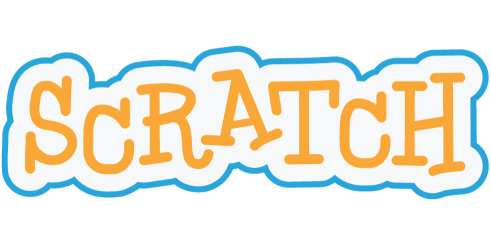

# Fase 1

Inicialmente, ocorre a formação dos grupos de estudo a partir da realização de dinâmicas, que tem como principal objetivo, otimizar a equipe para o desenvolvimento coletivo. Com as equipes formadas, damos início a apresentação da ementa, onde serão apresentado os conteúdos e as atividades que serão abordadas no decorrer da primeira fase. 

As atividades correspondentes a fase de aprendizado de lógica utilizam plataformas e conteúdos que desenvolvem o raciocínio dedutivo e que formarão os alicerces para o progresso das fases seguintes, buscando aumentar a compreensão do aluno e pensando em soluções com ferramentas digitais, com ênfase em lógica computacional e desenvolvimento de jogos e aplicativos mobile.  

**Serão utilizadas as seguintes plataformas:**

**HORA DO CÓDIGO**

Criado pela **Code**.org, a **Hora do Código** é um movimento global que busca mostrar como a programação pode estar ao alcance de todos! A ideia é programar por uma **hora** – realizando atividades na escola, em família ou com amigos.

**SCRATCH** 

Com o Scratch, pode programar as suas próprias estórias, jogos e animações interactivos – e partilhar as suas criações com outros na comunidade em linha. ****

O Scratch ajuda os jovens a pensar de forma criativa, a raciocinar sistematicamente e a trabalhar colaborativamente — competências essenciais à vida no século XXI.

O Scratch é um projecto do Lifelong Kindergarten Group do MIT Media Lab. É disponibilizado gratuitamente.

**MIT APP INVENTOR**

MIT App Inventor, também conhecido como App Inventor for Android, é uma aplicação código aberto originalmente criada pela Google, e atualmente mantida pelo Massachusetts Institute of Technology

Paralelo à utilização dessas plataformas, é incentivado ao aluno que observe a realidade e a situação a sua volta, e de como seu grupo pode contribuir para solucionar problemas existentes através do uso da tecnologias.

Nessa fase os alunos são levados a criar três projetos sendo eles auxiliado por profissionais preparados e outros alunos, o que dá ao mesmo a possibilidade de aplicar todos os conhecimentos adquiridos durante as aulas de forma autônoma. 

**Projeto 1** Jogos: Crie seu próprio jogo dentro do game Minecraft, usando a plataforma Hour Of Code.

**Projeto 2** Assistente Virtual: Crie um assistente virtual com reconhecimento de voz usando o App Inventor, que possa conversar e interagir quando for chamado pelo seu nome. 

**Projeto 3** Jogos Educativo: Crie um jogo, estilo histórico, programado em Scratch. Pode pedir auxílio a um professor de história com ideias e na acurácia da fundamentação. Mapas geográficos que tenham contexto histórico também são essenciais, logo o conhecimento em geografia também ajudará na execução.

