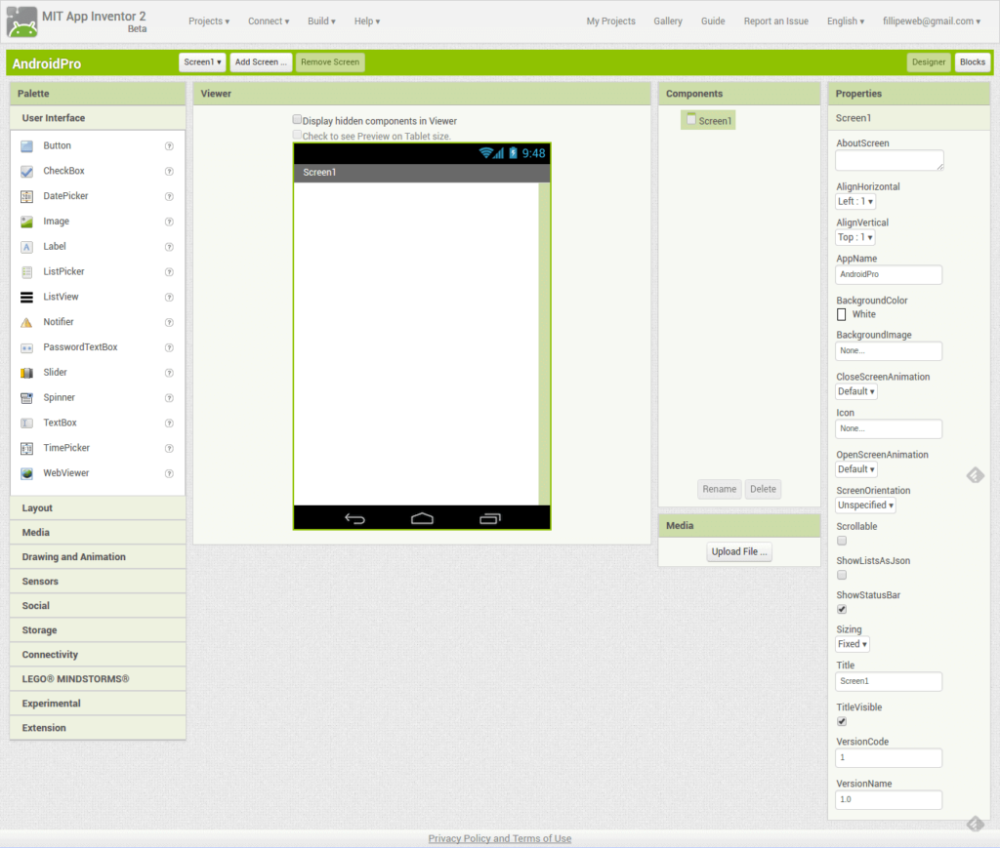
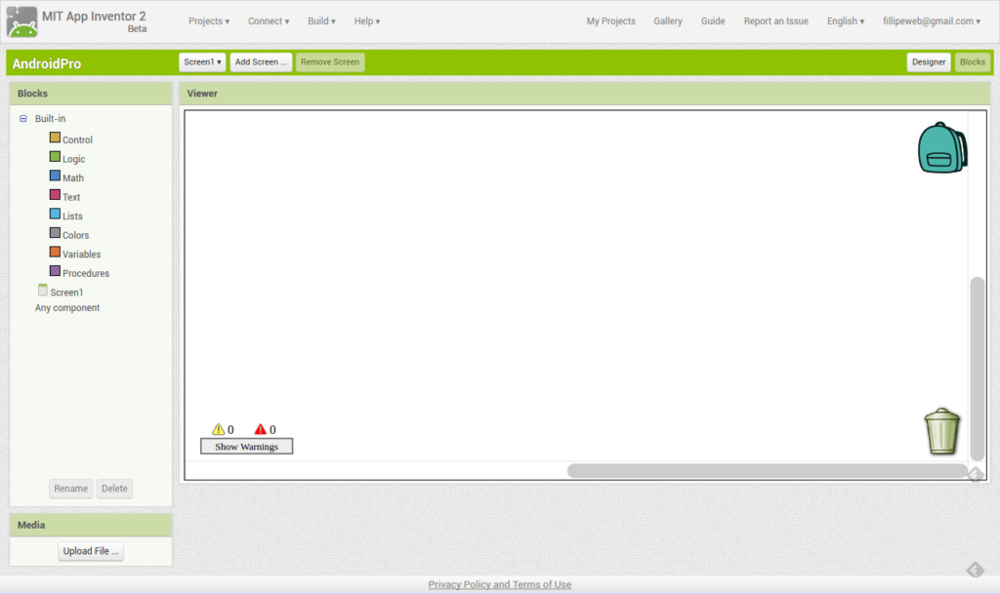
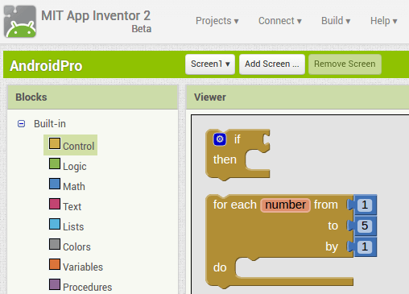

# Como funciona ?

### **Como Funciona**

O **App Inventor** basicamente é composto por duas seções: o **App Inventor Designer** e o **App Inventor Blocks Editor**, cada uma com uma função específica.

O primeiro tem o objetivo de construir a interface do seu aplicativo e o segundo de adicionar interatividade aos componentes na tela.

#### **App Inventor Designer**

O **App Inventor Designer** é a tela principal de um projeto.

É aqui que você desenha a intercace do seu aplicativo, escolhendo a posição dos botões e imagens, inserindo fotos, droplists, checkboxes e outros componentes disponíveis para a construção de um programa.

Ele é dividido em quatro colunas.

**Paleta**

A primeira coluna, chamada de “Palette” \(Paleta\), é onde ficam todos os componentes utilizáveis num aplicativo.

Esta paleta é dividida em seções para facilitar a localização dos componentes, que vão dos básicos \(botões, imagens e textos\) até uma seção exclusiva para integração com ferramentas de Lego Mindstorms.

Para utilizar um desses componentes basta clicar sobre ele e arrastar para cima da segunda coluna, chamada “Viewer” \(Visualizador\).

**Visualizador**

Na coluna “Viewer, você pode organizar cada um de seus objetos, montando o aplicativo como ele deve ser.

Uma janela de exibição simula a tela de um smartphone com o sistema operacional Android, apresentando uma versão próxima da final ao programador, à medida que ele organiza o espaço de uso do programa.

Todos os itens adicionados da “Palette” ao “Viewer” são apresentados na terceira coluna, chamada de “Components” \(Componentes\).

**Componentes**

Na coluna de componentes, ficam armazenados todos os itens adicionados, sejam eles visíveis ou não na tela do aplicativo. Dessa forma, fica muito mais simples selecionar cada objeto, pois eles estão listados de forma ordenada e acessível.

Aqui também é possível renomear cada item. Assim, você pode chamar os componentes por nomes que façam sentido para o seu projeto.

É muito mais fácil encontrar cada coisa se você mesmo criar um nome específico para ela, Como “botão de som” em vez de “Button1”.

É possível também inserir arquivos de mídia pela terceira coluna. Clicando no botão “Adicionar” \(Add\) você importa sons, fotos e vídeos do seu computador para o servidor do **App Inventor**, e eles ficam disponíveis para que você possa usar no projeto.

Clicar sobre qualquer um dos itens da lista na coluna “Components” permite que você possa editar seus detalhes na quarta coluna, chamada de “Properties” \(Propriedades\).

**Propriedades**

Esta é a coluna mais importante do **App Inventor Designer**, já que aqui você pode definir os tamanhos e conteúdos dos textos de botões e caixas de informação, tamanho das imagens, cores de fundo e largura e altura de objetos.

Essas e muitas outras configurações são aplicadas instantaneamente na tela da coluna “Viewer”, permitindo que você tenha sempre uma ótima ideia de onde e o que está mudando em seu programa.

Uma vez que seu aplicativo esteja parcialmente montado, é hora de começar a atribuir funções a cada um dos componentes que você selecionou. Para isso é preciso clicar no botão “Blocks” \(Blocos\), que o levará para uma nova tela.

#### **App Inventor Blocks Editor**

Acessando o “Blocks Editor” você pode começar a associar ações para cada item do seu aplicativo. Usando uma interface simples e intuitiva, a construção do aplicativo parece muito com montar um quebra-cabeça.

O menu na lateral esquerda fornece a aba de comandos: “Built-in” \(Internos\). Que são os comandos de execução.

A combinação de um ou mais comandos forma uma ação completa. E para facilitar a construção das ações, os comandos são estruturados como peças de quebra-cabeças. Apenas funções compatíveis se encaixam.

Por exemplo, você pode utilizar blocos de condicionais como if, for e etc. Assim é possível criar a lógica do seu aplicativo ligando com os componentes de tela que você adicionou no editor de design.



