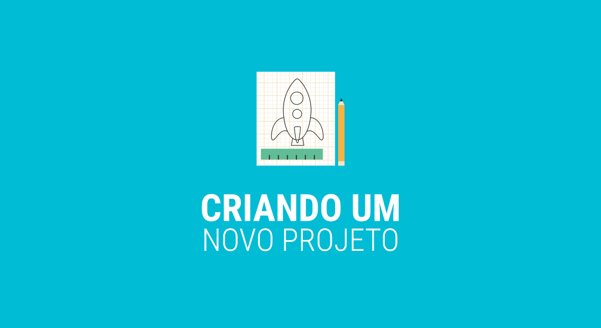

# Criando Um Novo Projeto

Nessa sessão vamos usar os seguintes componentes

| Componente | Descrição |
| :--- | :--- |
| Horizontal Arrangement | Localizado Na Pallet de Layout Ele divide a tela para podemos colocar duas informações uma ao lado da outra |
|  Label | Localizada na Pallet de User Interface, com ela vamos mostrar na tela um texto  |



### Testando Nosso Primeiro App



## 

