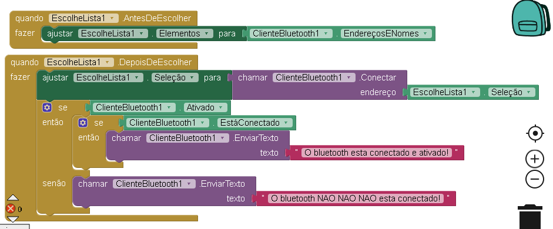
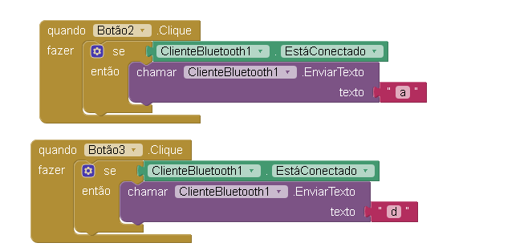
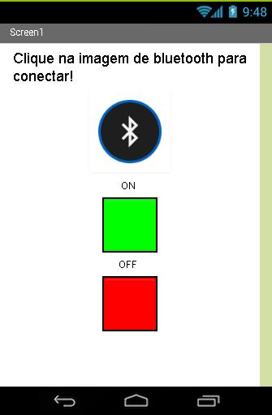

# Criando App para controlar um led com Bluetooth\(parte 1\)

### Código 

Quando Clicado Ele Envia um alerta para Tela

Quando Conectado se pressionar butão 2 envia tecla a para ligadar led, caso envia d desliga o led

### Layout  e Componentes

### 

### Imagens

