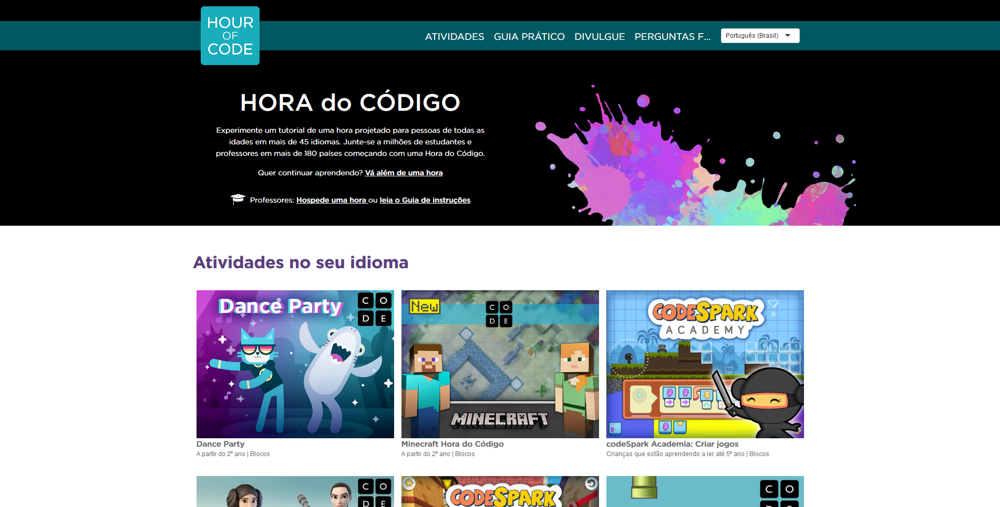

# Primeiros Passos com HORA do código

### Complete as atividades no site 



### [Cartilha para Escolas da Hora do Código](http://programae.org.br/wp-content/uploads/2018/11/Cartilha_Hora_do_C%C3%B3digo_2018.pdf)

### **Introdução** 

**PS: Ative a legenda para português.**



Nessa Fase inicial vamos aprender logica e conceitos basicos de ciencias da computação  desenvolvendo jogos  

### Trilha Base 









