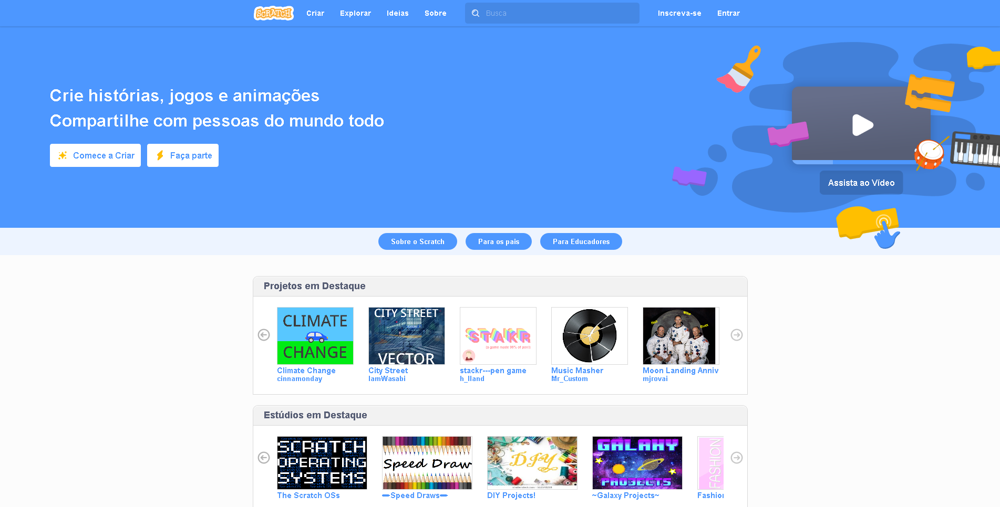
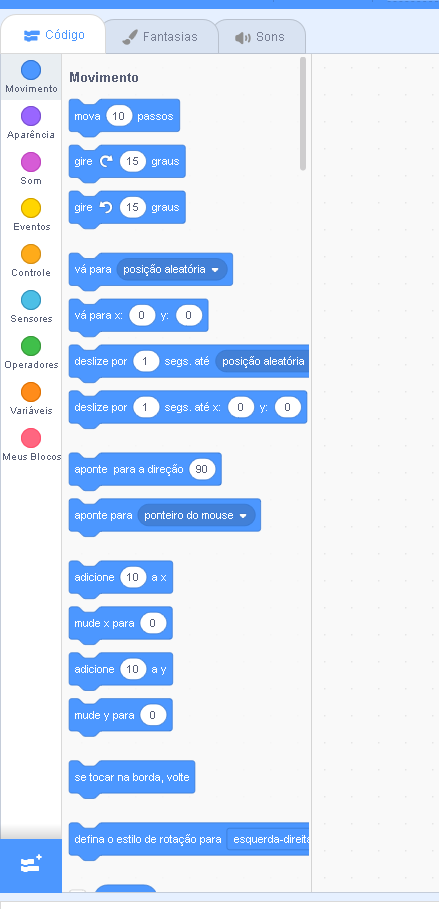
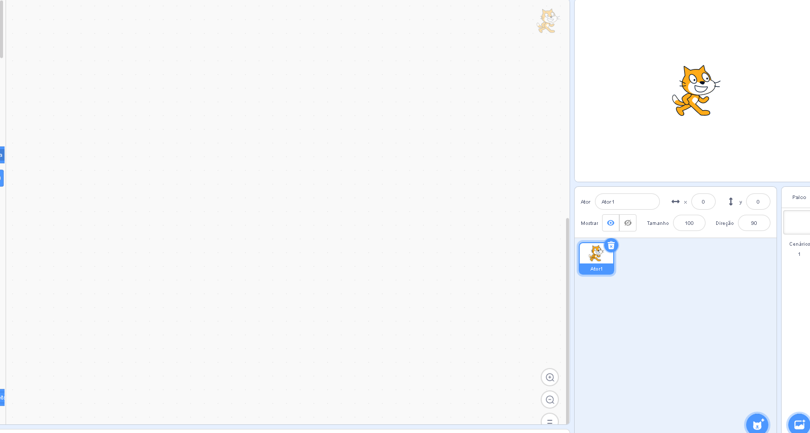
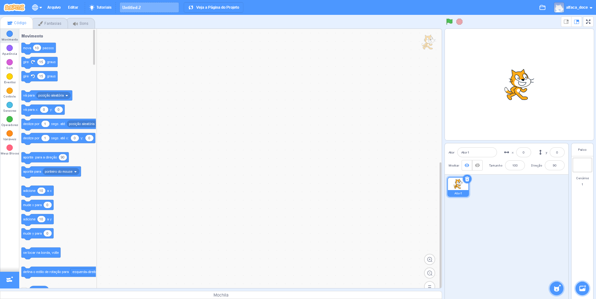

# Primeiros Passos com Scratch

### O que é Scratch ? 

 O Scratch é um programa desenvolvido pelo Instituto Tecnológico de Massachussets \(MIT, experiente no desenvolvimento de ferramentas educativas para crianças na idade escolar\) e pelo grupo KIDS da Universidade de Califórnia, Los Angeles.  
             Scratch é um novo contexto de programação visual e multimídia baseado em Squeak. Está destinado à criação e promoção de sequencias animada para a aprendizagem de programação de forma simples e eficiente. Oferece uma interface intuitiva e muito fácil de compreender. No Scratch é possível trabalhar com imagens, fotos, música, criar desenhos, mudar aparência, fazer com que os objetos interatuem... Sua programação é inteiramente visual. Ele recupera o modelo construtivista do Logo e dos E-Toys Squeak.  Os destinatários do Screatch são crianças do ensino fundamental, permitindo a construção de animações, trabalhando também, numa abordagem interdisciplinar, ou seja, utilizar conceitos das disciplinas escolares para montar projetos específicos e permitir que que as crianças aprendam de forma criativa e saborosa.



\*\*\*\*

###  **APRESENTAÇÃO**

  
 Quando você abrir o Scratch, você vai encontrar esta janela. Perceba que o programa contém várias partes:  
 1 - Botões de programação;  
 2 - Área de programação \(comandos, trajes e sons\);  

 3 - Tela de animação;  
 4 - Objetos\(hierarquia\)e palco.

**Tela Completa** 

Na área de animação, você escolhe os sprites que deseja inserir e utilizar para programar a sua animação.  
 ****Clique no sprite que você deseja programar e comece a arrastar os blocos de programação para a área de programação \(meio\). Quando quiser saber os efeitos de sua programação, clique na bandeira verde para visualizar.  
       Os botões de programação estão divididos em categorias:

| Categorias | Descrição |
| :--- | :--- |
| Movimento | Control do Personagem e Movimentação em Geral |
| Aparencia  | Troca de Trafe do Personagem |
| SOM | Controla Sons do Jogo ou ambiente |
| Sensores | Recebe dados de entrada como mouse e teclado e gera saida para controle |
| Operadores | Matematicos e Logicos |
| Variaveis | Cria Novas variaveis ou blocos |
| Controle  | Usa Controle de Repetições como Enquanto e Repetir |

  
Em Arquivos de Programas/Scratch/Projetos \(se o Scratch estiver instalado no seu computador\), você encontra várias animações que o próprio programa oferece. Abra esses projetos e execute-os passo a passo. Assim, é possível adquirir uma boa noção de programação Scratch e evoluir no aprendizado

### Como Logar na Plataforma ? 

Cadastre-se 



Ative sua Conta no Seu email\(opcional\)

E por fim logar-se  e Criar seus jogos ! 



### UHUuuu  !!!!!



