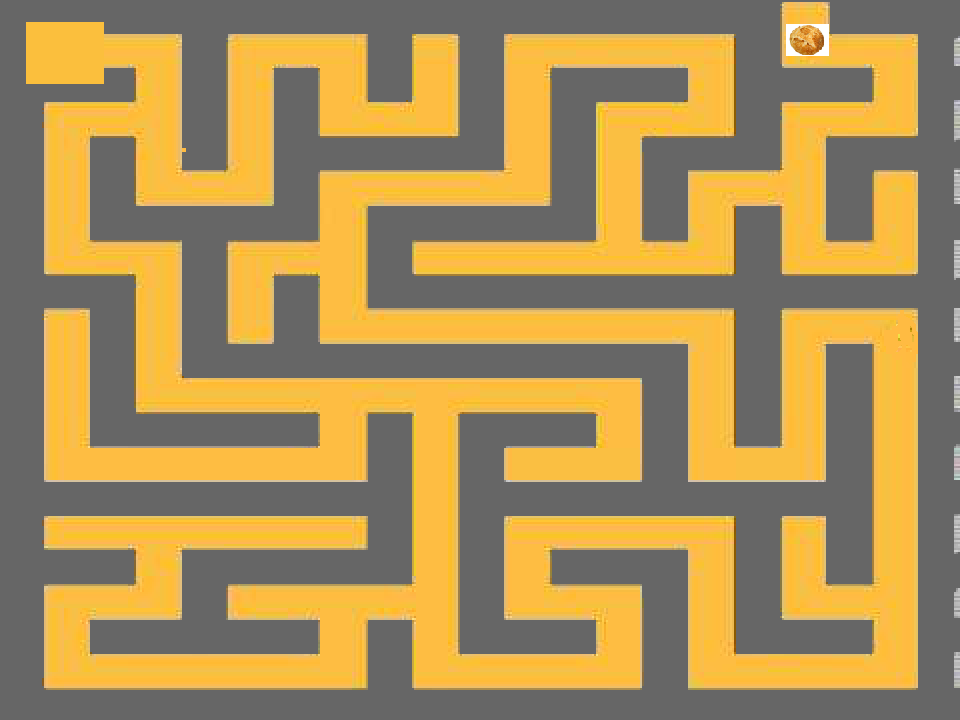
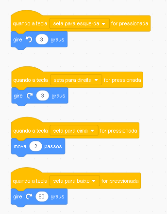

# Criando meu Primeiro Jogo !!!!!\(Parte 1\)

### Traje do ATOR

### MAPA

### Controles

| Controle | Telas | função |
| :--- | :--- | :--- |
| Andar | Seta Para Cima | Mova 2 Passos |
| Voltar | Seta Para Baixo | Vire 90 graus |
| Direita | Seta Para Direita | Gira 3 Graus |
| Esquerda | Seta para Esquerda | Gira 3 Graus |

### Testando o Movimentos 



