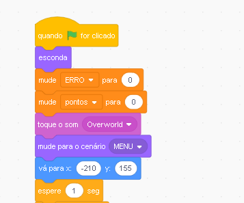
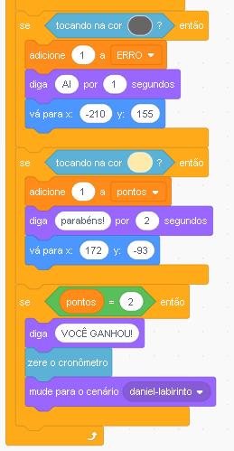

# Criando meu Primeiro Jogo !!!!!\(Parte 2\)

### Animação

Ao Adicionar o MAPA, crie um menu não precisa ser semelhante pode mudar a **cor mas lembre-se de mudar a cor no código fonte.**

### Código ****

Descrição 

Iniciar primeiros estágios do jogo

Um loop roda e dentro dele tem os blocos de SE, se o mouse for pressionado mostre e se tocar na cor vermelha então defina o damanho de 15 para o ator e mude o cenário para **LABIRINTO** e vá para  x e y.

Se a variável ERROR for igual a 5 então diga q morreu e zere o cronometro

Se tocar na cor preta e conta o erro adicionando mais 1 dentro da variavel erro, mostra o Ai por 1 segundo e volta para o ponto zero do jogo

Se tocando na cor de pele, adicione mais 1 e diga parabens e mora para posição x e y. 

Se variavel pontos for igual a 2 diga !!! VC GANHOU !!!!

