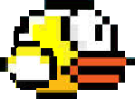

# Criando Meu Próprio Flappy Bird \(parte 1\)


Nessa sessão vamos criar um jogo SIMILAR 

Primeiro Vamos Baixar as seguintes imagens 

### Ator





### Ambiente


| Descrição dos Blocos |
| :---: |


```text
Bloco 1: bloco de animaçao
```


> Descrição:

```text
bloco 2: E o bloco que faz o efeito 
gravidade e os jumps!
```


> Descrição:

```text
bloco 3: E o bloco que quando o passaro encostar
no cano ele perde o jogo
```


