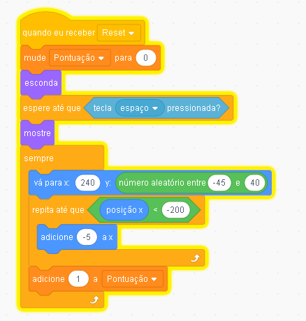
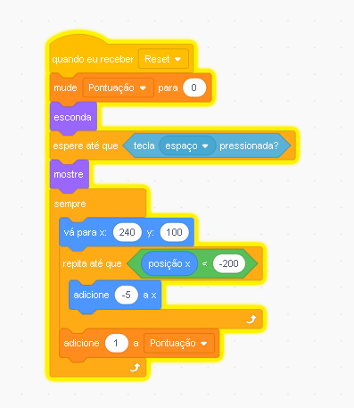
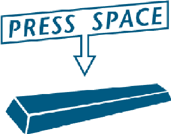
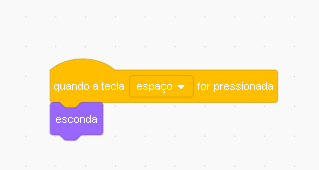
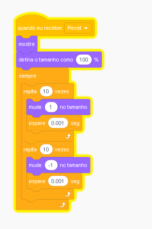

# Criando Meu Próprio Flappy Bird\(Parte 2\)

### Nó Cenário  Devemos addicionar os blocos e objetos 


| Descrição do Bloco 1 |
| :--- |


```text
Bloco 1: E o bloco que vai dar o efeito
de ilusão que vai fazer parecer que o passaro
estar se movendo, mas na verdade o cano que se movera
```



### Objetos Cano de base


## Emendas Canos

PS: Ao adicionar esse componente coloque na mesma posição do cano de base anterior há cima.


Bloco de Código do Cano de Emendas


| Descrição do bloco  |
| :--- |


```text
Bloco 1: E o mesmo efeito do outro cano 
com a diferencia que esse cano vai mudar a posiçao 
dos canos, gerando uma dificuldade ou um 'cenario' diferente
```



## Adicione a Animação de Press Space



Use o bloco de código no cenário 





Bloco 1: E o bloco que vai diminuir e aumentar de tamanho que vai dar um efeito de tipo aperte agora a tecla espaço!

Bloco 2: O segundo bloco vai esconder a imagem de press space


