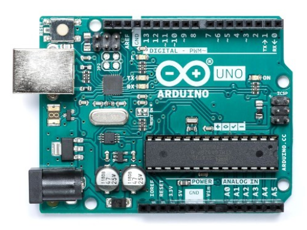
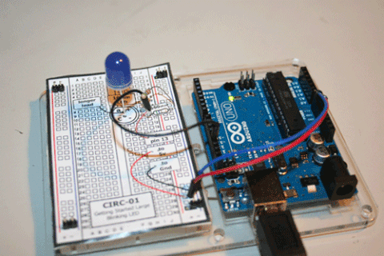
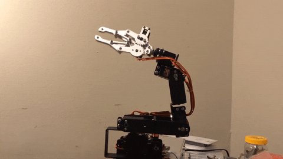
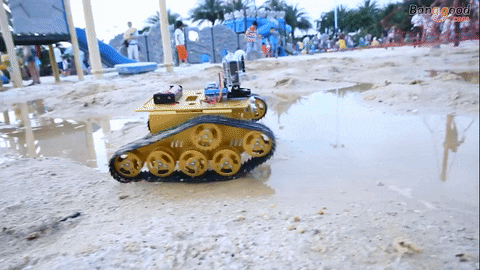
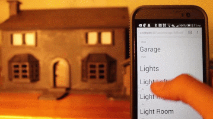

# Introdução a Arduino

## Arduino o que ser isso ? 

Assim como todo computador tem uma placa mãe, os robôs e sistemas de eletronica tambem tem uma placa mãe para uso padrão, normalmente usamos um arduino para programar a forma como nossos projetos vão sentir e atuar.

Arduino é uma plataforma de prototipagem eletrônica de hardware livre e de placa única, projetada com um microcontrolador Atmel AVR com suporte de entrada/saída embutido, uma linguagem de programação padrão, a qual tem origem em Wiring, e é essencialmente C/C++.

### O que podemos fazer com essa placa ? 

Podemos construir tudo que você pode imaginar ! o limite do que podemos fazer é sua criatividade ! Com ela podemos construir projetos simples como contrar um led para pistar, programar robôs, automatizar a sala de aula de uma escola inteira ou simplemente do seu quarto, tambem podemos saber o que as plantas sentem quando estão muito umidas ou secas e automatizar a rega.

### Sim !!!! Podemos Construir Robôs ! 

#### Braços Robóticos com Arduino, esse braço é bastante simples, ele usa 4 motores e 1 garra mecânica esse tipo de projeto pode ser aplicado e construido para automatizar tarefas e auxiliar em serviços repetitivos e automaticos como, pintar, arrumar uma mesa, pegar objetos em competições.

### Robôs Exploradores 

#### Robôs com Chassi de Tank Esse tipo de plataforma é extremamente útil quando estamos pensando em robôs que vão andar em terrenos muito difíceis, normalmente é usado em para coleta de dados.

### Robôs controlados por aplicativo 

Nesse projeto podemos controlar nosso robô usando arduino com app inventor, a ideia e que podemos usar nossos conhecimentos em desenvolvimento de apps para desenhar todo nosso aplicativo e paralelo construir nosso robô com arduino usando bluetooth como recurso de comunicação é movimentação do robô.

### Com arduino podemos também criar eletrônica vestível 

### O que é vestível ? 

Vestíveis ou wearables é a palavra que resume o conceito das chamadas “tecnologias vestíveis”, que consistem em dispositivos tecnológicos que podem ser utilizados pelos usuários como peças do vestuário/roupas ou pets.

### Automação Residencial ou Predial 

Imagine controlar as lampadas da sua casa ou automatizar as lampadas da sala de aula, além de controlar lampada podemos controlar janelas ou portões, com automação é possível automatizar processos para reduzir custos e ter mais conforto.

## OK, depois de vermos tudo isso vamos trabalhar ! Nos Próximos posts vamos começar nossa imersão nesse mundo MAKER{^\_^} e voltar a programar ! 

