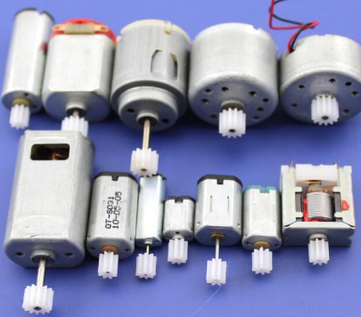
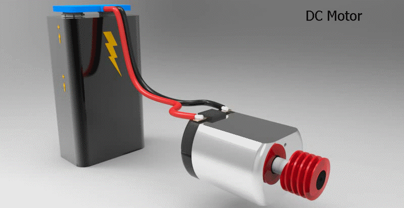

# Atuadores

## Motores DC

Esse motor normalmente é usado para projetos com robôs, carrinhos de corrida ou quando exige um certo controle para rotacionar determinado tipo de objeto.

#### 

### Servo Motor

O Esse tipo de Motor tem um motor DC interno que se movimenta por meio de controle de um potenciometro que define quantos graus deve ser movimentar. Um exemplo de sua aplicação é o braço robotico de acrilico, controle das asas de um aeromodelo, 

### Motor de Passos

O motor de passos tem um objetivo mais expecifico que é ter um controle mais efetivo e mais preciso para aplicações mais especificas como impressoras 3d ou maquinas de corte a laser para movimentação dos eixos.

