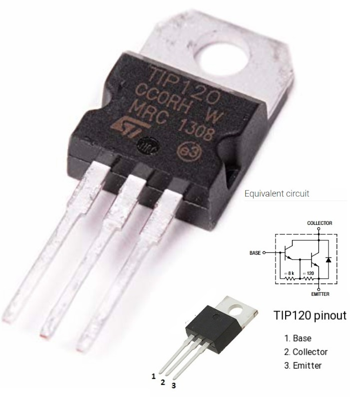
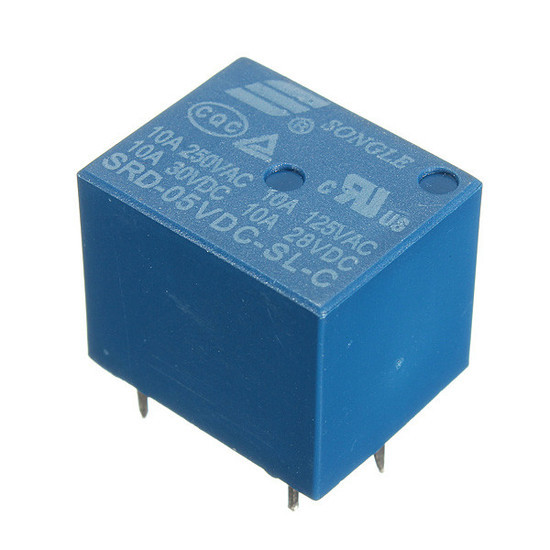
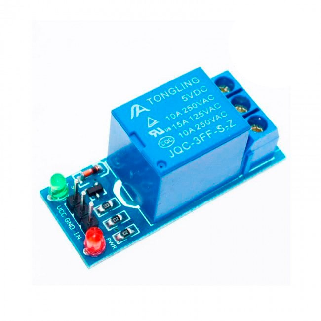
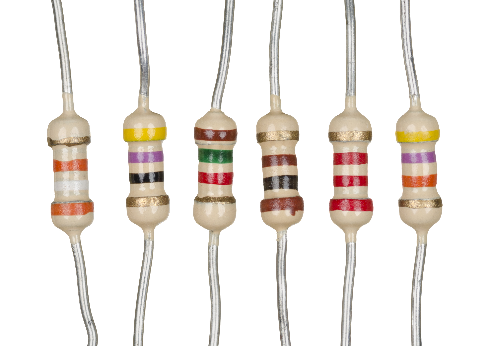

# Eletrônica Basica

### TRANSISTOR \(TIP 120\)

Transístor ou transistor é um dispositivo semicondutor usado para amplificar ou trocar sinais eletrônicos e potência elétrica. É composto de material semicondutor com pelo menos três terminais para conexão a um circuito externo.





### RELÊ

 Um **relé** \(do francês relais\), ou, menos frequentemente, **relê**\(por influência do inglês relay, embora esta forma ainda não esteja dicionarizada\) é um interruptor eletromecânico.

### Modulo Relê

Com o Módulo Relé 5V 1 Canal você pode controlar lâmpadas, motores, eletrodomésticos e outros equipamentos utilizando apenas um pino de controle, já que o circuito a ser alimentado fica completamente isolado do circuito do microcontrolador. Fácil utilização com Arduino.



### RESISTOR

 **Resistores** são dispositivos elétricos que compõem circuitos com a finalidade básica de transformar energia elétrica em calor ou mudar o valor da ddp. Bem vindo ao Player Audima. Clique TAB para navegar entre os botões, ou aperte CONTROL PONTO para dar PLAY. CONTROL PONTO E VÍRGULA ou BARRA para avançar.



## 

