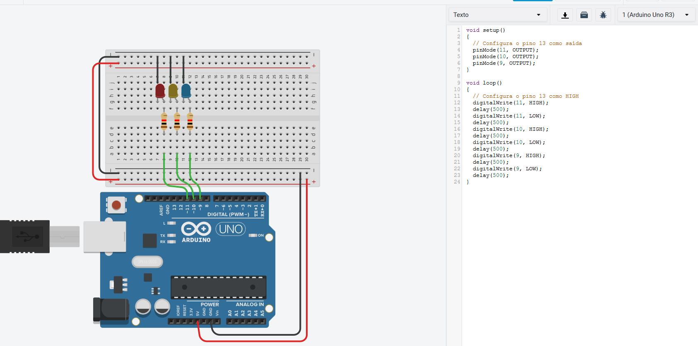

# Brincando com resistores e leds

### Descrição do Resistor

**Resistores** são dispositivos elétricos que compõem circuitos com a finalidade básica de transformar energia elétrica em calor ou mudar o valor da ddp. Bem vindo ao Player Audima. Clique TAB para navegar entre os botões, ou aperte CONTROL PONTO para dar PLAY. CONTROL PONTO E VÍRGULA ou BARRA para avançar.

### Código


```c
void setup() 
{
  // Configura o pino 13 como saída 
  pinMode(13, OUTPUT);
  pinMode(12, OUTPUT);
  pinMode(11, OUTPUT);
}

void loop() 
{
  // Configura o pino 13 como HIGH
  digitalWrite(13, HIGH);
  delay(500);             
  digitalWrite(13, LOW);   
  delay(500);           
  digitalWrite(12, HIGH);
  delay(500);             
  digitalWrite(12, LOW);   
  delay(500);            
  digitalWrite(11, HIGH);
  delay(500);             
  digitalWrite(11, LOW);   
  delay(500);            
}
```

### Circuito no Simulador



### Teste


