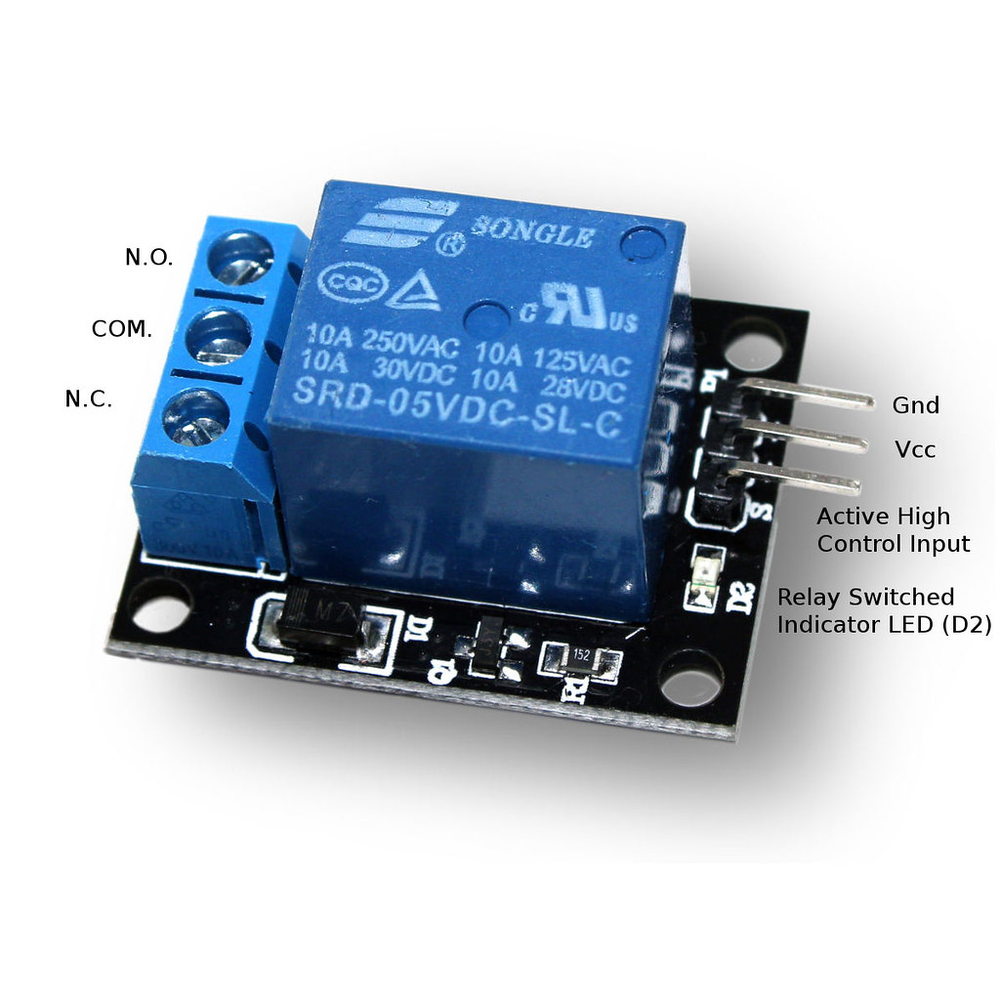
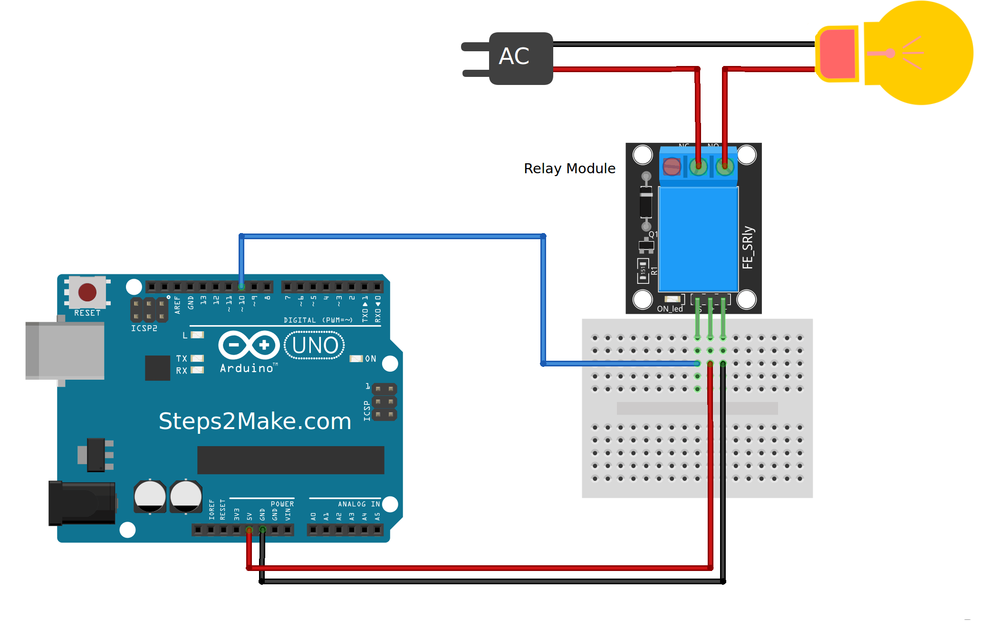

# Usando Modulo relê para controlar uma lampada

### Descrição do Modulo relê

Este modulo Relé 5V com 1 canal é a alternativa perfeita pra quem busca um módulo compacto e de qualidade para projetos com Arduino e outros controladores.



### Código V1

```c
int rele= 10;

void setup(){
 pinMode(rele,OUTPUT);
}
void loop(){
 digitalWrite(rele,HIGH);
 delay(1000);
 digitalWrite(rele,LOW);
 delay(1000);
}
```

### Circuito v1




### Código V2

```c
int rele= 7;
char letra;

void setup(){
 Serial.begin(9600);
 pinMode(rele,OUTPUT);
}
void loop(){
 letra = Serial.read();
 switch(letra){
  case 'l':
  digitalWrite(rele,HIGH);
  break;
  case 'd':
  digitalWrite(rele,LOW);
  break;
 }
}
```

### Circuito V2 


