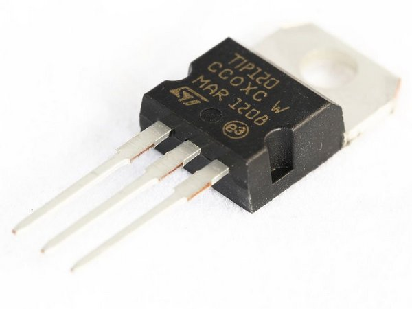

# Usando TIP 120 para controlar um LED

### Descrição

Transistor NPN TIP120, é um transistor de média potência para aplicações de chaveamento e amplificação.

O TIP120 possui encapsulamento convencional \(TO220AB\).

**Descrição do fabricante:** NPN Epitaxial Darlington Transistor



### Código

```c
int tip = 3;

void setup(){
 pinMode(tip,OUTPUT);
}
void loop(){
 digitalWrite(tip,HIGH);
 delay(1000);
 digitalWrite(tip,LOW);
 delay(1000);
}
```

### Circuito


