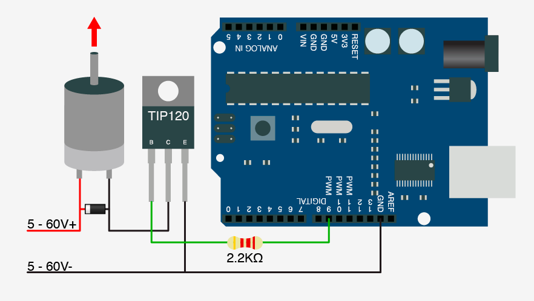

# Usando TIP 120 para Controlar um Motor DC

### Circuito



### Código


```c
int tip = 9;

void setup(){
 pinMode(tip,OUTPUT);
}
void loop(){
 digitalWrite(tip,HIGH);
 delay(1000);
 digitalWrite(tip,LOW);
 delay(1000);
}
```

### Teste de Bancada




