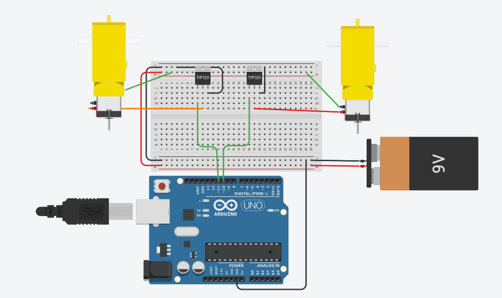
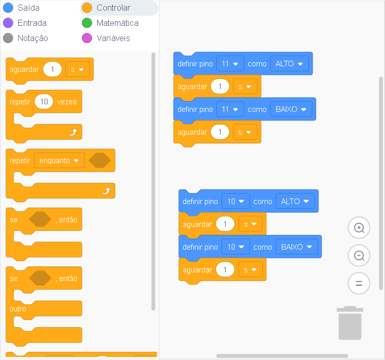

# Usando TIP 120 para Controlar um Motor DC

### Circuito com 1 Motor


### Código em C


```c
int tip = 9;

void setup(){
 pinMode(tip,OUTPUT);
}
void loop(){
 digitalWrite(tip,HIGH);
 delay(1000);
 digitalWrite(tip,LOW);
 delay(1000);
}
```

### Circuito com 2 Motores



### Itens Utilizados 

| Descrição | compoentes |
| :--- | :--- |
| Controlador Logico | Arduino UNO |
| Transistor tipo NPN | TIP 120 |
| Atuador | Motor DC com Caixa de Redução |
| Bateria | Bateria de 9v |

### Código em Blocos



### Simulação




