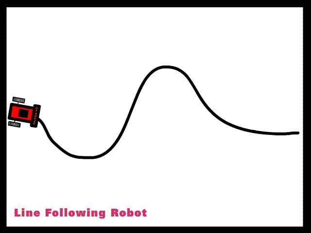
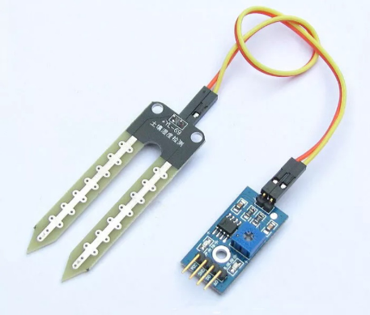
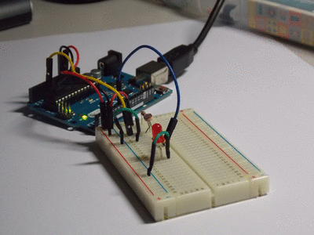

# Sensores

Existem vários tipos de **sensores** que respondem à estímulos diferentes como por exemplo: calor, pressão, movimento, luz e outros.

### Sensor ULTRASSÔNICO

É um dispositivo que utiliza alta frequência de som para medir a distância entre itens determinados. Estes **sensores** são também conhecidos como transceptores, e são capazes de operar semelhante ao sonar.



### Sensor de LINHA

Conforme a linha for detectada \(ou não\), cada sensor enviará ao Arduino as informações sobre a intensidade do sinal infravermelho refletido, e o programa usará essas informações para calcular a velocidade de cada motor.



### Sensor COR

Os sensores de cor registram a cor de uma superfície. Após emitir uma luz \(vermelha, verde, azul\)     em direção aos objetos a serem testados, esses sensores calculam as coordenadas de cromaticidade com base na radiação refletida e as comparam com valores de referência cromáticos previamente armazenados. Se os valores cromáticos estiverem dentro da faixa de tolerância ajustada, uma saída de comutação será ativada.



### Sensor de UMIDADE DE SOLO

É composto basicamente duas hastes que ficaram presas ao solo que iremos monitorar e um circuito comparador que irá nos retornar o nível de condutividade do solo. Essas duas hastes são dois eletrodos no qual conduzirá uma corrente passando pelo solo. Dessa forma é possível ler o nível de umidade por comparação com a resistência do potenciômetro do módulo do sensor.



### Sensor de UMIDADE E TEMPERATURA AMBIENTE

Ele fornece tanto temperatura quanto umidade do ar instantaneamente. Ele utiliza um sensor capacitivo de umidade e um termistor para medir o ar circundante, ambos conectados a um controlador de 8 bits que produz um sinal digital serial no pino de dados \(Data\).



### Sensor de LUMINOSIDADE

O Sensor de Luminosidade LDR \(Light Dependent Resistor\) é um componente cuja resistência varia de acordo com a intensidade da luz. Quanto mais luz incidir sobre o componente, menor a resistência. Este sensor de luminosidade pode ser utilizado em projetos com arduino e outros microcontroladores para alarmes, automação residencial, sensores de presença e etc.



### 

## Esses são os tipos mais comuns dos sensores com eles podemos fazer vários projetos e construir muitas coisas. Bem vindo ao mundo dos sensores {^\_^}.

