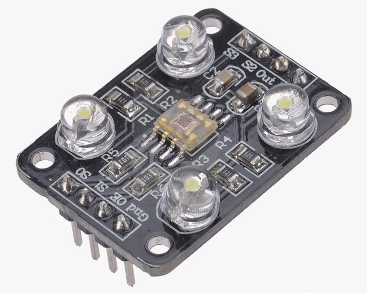
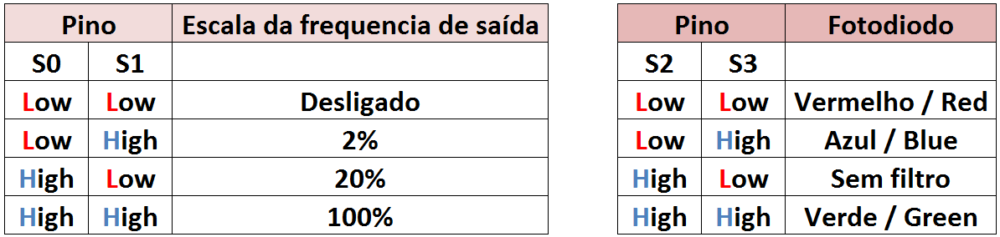
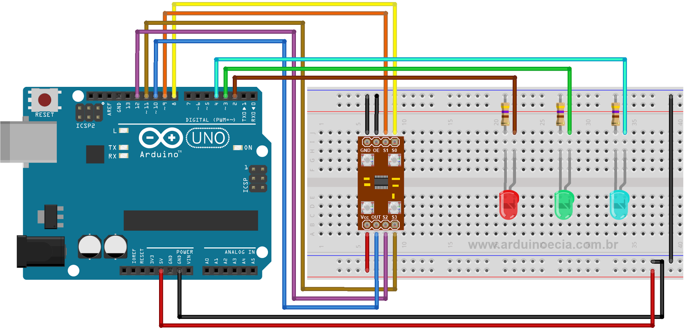
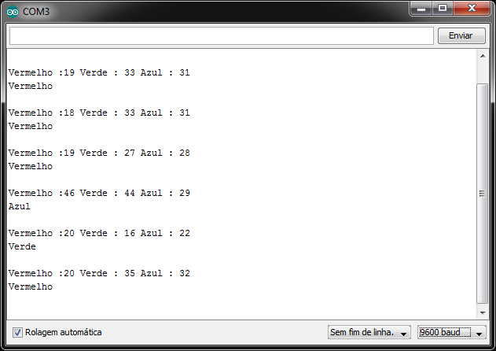

# Tutorial Sensor de COR

### Descrição do Sensor

 Esse módulo usa o **sensor TCS230** \([**datasheet**](https://goo.gl/vN447y)\), que é composto por 64 fotodiodos. Desses 64 fotodiodos, 16 tem filtros para a cor vermelha, 16 para a cor verde, 16 para a cor azul e 16 não tem filtro algum. Distribuídos uniformemente sobre o sensor, esses sensores captam a luminosidade, filtrando as cores, e geram na saída um sinal de onda quadrada com as informações sobre a intensidade das cores **vermelho \(R = Red\)**, **verde \(G = Green\)** e **Azul \(B = Blue\)**.



 O módulo aceita alimentação de 3 à 5 volts e são utilizados 5 pinos para conexão ao Arduino : os pinos de controle **S0, S1, S2, S3**, e o pino **OUT**, que é o responsável pelo envio das informações.  
 O pino **OE** \(Output Enable, ou saída habilitada/ativada\) deve ser ligado ao GND, já que o módulo vai enviar informações continuamente ao Arduino.

### Tabela de Cores



### Código

```c
//Pinos de conexao do modulo TCS230  
const int s0 = 8;  
const int s1 = 9;  
const int s2 = 12;  
const int s3 = 11;  
const int out = 10;   
   
//Pinos dos leds  
int pinoledverm = 2;  
int pinoledverd = 3;  
int pinoledazul = 4;  
    
//Variaveis que armazenam o valor das cores  
int red = 0;  
int green = 0;  
int blue = 0;  
    
void setup()   
{  
  pinMode(s0, OUTPUT);  
  pinMode(s1, OUTPUT);  
  pinMode(s2, OUTPUT);  
  pinMode(s3, OUTPUT);  
  pinMode(out, INPUT);  
  pinMode(pinoledverm, OUTPUT);  
  pinMode(pinoledverd, OUTPUT);  
  pinMode(pinoledazul, OUTPUT);  
  Serial.begin(9600);  
  digitalWrite(s0, HIGH);  
  digitalWrite(s1, LOW);  
}  
    
void loop() 
{  
  color(); //Chama a rotina que le as cores  
  //Mostra no serial monitor os valores detectados  
  Serial.print("Vermelho :");  
  Serial.print(red, DEC);  
  Serial.print(" Verde : ");  
  Serial.print(green, DEC);  
  Serial.print(" Azul : ");  
  Serial.print(blue, DEC);  
  Serial.println();  

  //Verifica se a cor vermelha foi detectada  
  if (red < blue && red < green && red < 100)  
  {  
   Serial.println("Vermelho");  
   digitalWrite(pinoledverm, HIGH); //Acende o led vermelho  
   digitalWrite(pinoledverd, LOW);  
   digitalWrite(pinoledazul, LOW);  
  }  

  //Verifica se a cor azul foi detectada  
  else if (blue < red && blue < green)   
  {  
   Serial.println("Azul");  
   digitalWrite(pinoledverm, LOW);  
   digitalWrite(pinoledverd, LOW);  
   digitalWrite(pinoledazul, HIGH); //Acende o led azul  
  }  

  //Verifica se a cor verde foi detectada  
  else if (green < red && green < blue)  
  {  
   Serial.println("Verde");  
   digitalWrite(pinoledverm, LOW);  
   digitalWrite(pinoledverd, HIGH); //Acende o led verde  
   digitalWrite(pinoledazul, LOW);  
  }  
  Serial.println();  

  //Aguarda 2 segundos, apaga os leds e reinicia o processo  
  delay(2000);   
  digitalWrite(pinoledverm, LOW);  
  digitalWrite(pinoledverd, LOW);  
  digitalWrite(pinoledazul, LOW);  
 }  
    
void color()  
{  
  //Rotina que le o valor das cores  
  digitalWrite(s2, LOW);  
  digitalWrite(s3, LOW);  
  //count OUT, pRed, RED  
  red = pulseIn(out, digitalRead(out) == HIGH ? LOW : HIGH);  
  digitalWrite(s3, HIGH);  
  //count OUT, pBLUE, BLUE  
  blue = pulseIn(out, digitalRead(out) == HIGH ? LOW : HIGH);  
  digitalWrite(s2, HIGH);  
  //count OUT, pGreen, GREEN  
  green = pulseIn(out, digitalRead(out) == HIGH ? LOW : HIGH);  
}
```

### Circuito



### Teste de Porta Serial



### Teste de Bancada




