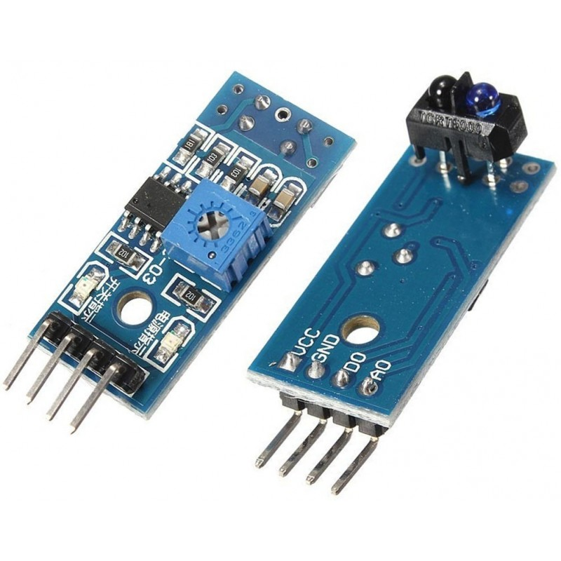

# Tutorial Sensor de LINHA

### Descrição do Sensor

Sensor de Linha usa um led emissor e um led receptor,  quando detectar linha ele envia para o arduino valor de 1 ou 0. 


### Código 

```c
int sensor_linha = A0;
int valorSensor = 0;
 
void setup(){
    Serial.begin(9600);
}
 
void loop(){
    valorSensor = analogRead(sensor_linha);
    int valorCorrigido = (valorSensor * 5) / 1024;
 
    if(valorCorrigido > 0)
        Serial.println("Linha Detectada!!!");
 
    delay(1000);
}
```

### Circuito

Versão protoboard - utilizada para testar em simulação para ver como funciona e entender os principios de sua aplicação.


Versão Modular - Utilizada em competições por ser mais simples de utilizar é permitir facilidade de implementação no projeto.




## Teste de Bancada 




