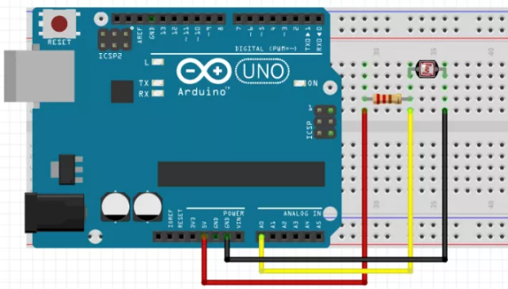

# Tutorial Sensor de  Luminosidade

### Descrição do Sensor

O **LDR \(**Light Dependent Resistor ou Resistor Dependente de Luz**\)** é um componente eletrônico cuja resistência varia em função da luminosidade que incide sobre o mesmo. Este componente é sensível a luz e tem como finalidade limitar a passagem de corrente em um circuito.

O **LDR** ou **Fotoresistor** como também é conhecido, é um tipo de resistor, porém variável. Quanto maior for a quantidade de luz que incide sobre o LDR menor será a resistência oferecida por ele e quanto menor a quantidade de luz sobre o mesmo maior será a resistência oferecida. Vale ressaltar que o LDR assim como um resistor comum, não possui polarização e sua resistência é medida em ohms, que com ausência de luz gira em torno de 1MΩ e com presença de luz fica entre 10 e 20KΩ.


### Código

```c
const int pinoLDR = A0; //PINO ANALÓGICO UTILIZADO PELO LDR
  
void setup(){  
  pinMode(pinoLDR, INPUT); //DEFINE O PINO COMO ENTRADA
  Serial.begin(9600);
}    
void loop(){
Serial.println(analogRead(pinoLDR));
delay(10);

}
```

### Circuito




