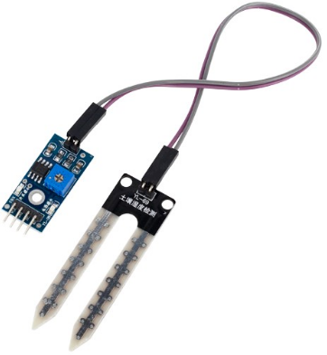
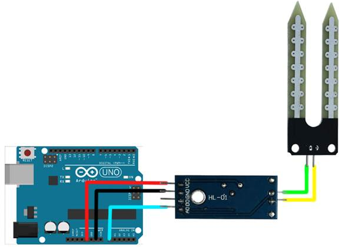
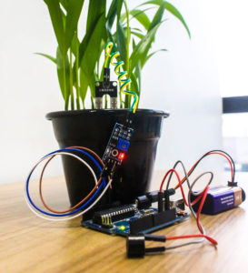

# Tutorial Sensor de UMIDADE DE SOLO

### Descrição do Sensor

Este sensor foi feito para detectar as variações de umidade no solo, sendo que quando o solo está seco a saída do sensor fica em estado alto, e quando úmido em estado baixo.

O limite entre seco e úmido pode ser ajustado através do potenciômetro presente no sensor que regulará a saída digital D0. Contudo, para ter uma resolução melhor, é possível utilizar a saída analógica A0 e conectar a um conversor AD, como a presente no [Arduino](https://www.filipeflop.com/categoria/arduino/placas-arduino/), por exemplo.



| PINAGEM | DESCRIÇÃO |
| :--- | :--- |
| VCC / Alimentação | 3,3 - 5V |
| GND/TERRA | GND |
| D0 | SAIDA DE DIGITAL |
| A0 | SAIDA ANALOGICA |


### Código

```c
 
#define pino_sinal_analogico A0
 
int valor_analogico;
 
void setup()
{
  Serial.begin(9600);
  pinMode(pino_sinal_analogico, INPUT);
}
 
void loop()
{
  //Le o valor do pino A0 do sensor
  valor_analogico = analogRead(pino_sinal_analogico);
 
  //Mostra o valor da porta analogica no serial monitor
  Serial.print("Porta analogica: ");
  Serial.print(valor_analogico);
 
  //Solo umido, acende o led verde
  if (valor_analogico > 0 && valor_analogico < 400)
  {
    Serial.println(" Status: Solo umido");
  }
 
  //Solo com umidade moderada, acende led amarelo
  if (valor_analogico > 400 && valor_analogico < 800)
  {
    Serial.println(" Status: Umidade moderada");
  }
 
  //Solo seco, acende led vermelho
  if (valor_analogico > 800 && valor_analogico < 1024)
  {
    Serial.println(" Status: Solo seco");
  }
  delay(100);
}
```

### Circuito



### Projeto

Usar esse sensor com um modulo relê para controlar e acionar rega da planata.



### Teste de Bancada




