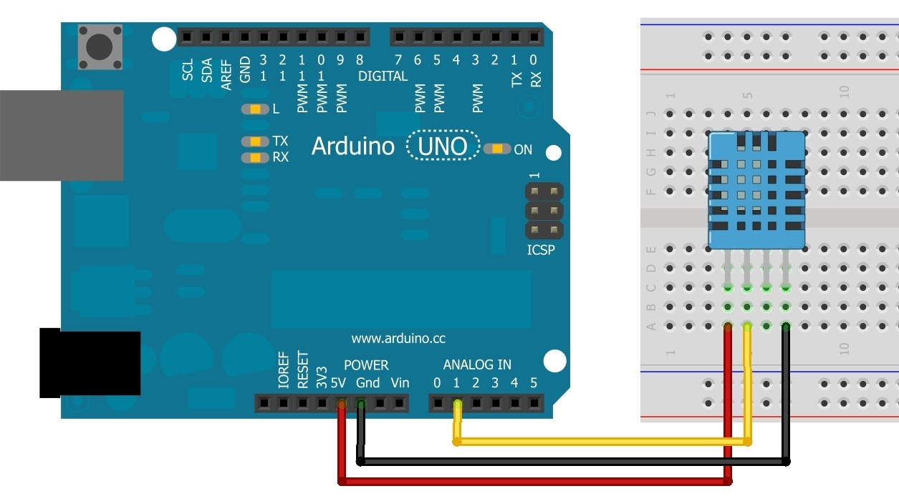

# Tutorial Sensor de UMIDADE E TEMPERATURA AMBIENTE

### Descrição de Componente 

Este sensor consiste em pegar dados do ambiente como umidade e temperatura, para usar ele vamos sua biblioteca especial, vale ressaltar que para esse tutorial vamos usar o **DHT11.**

### **Especificações:**

| Descrição | Informações  |
| :--- | :--- |
| Alimentação | 3,3 - 5V |
| Corrente | 200uA - 500mA |
| Faixa de Medição de Umidade | 20 a 90%  |
| Faixa de Medição de Temperatura | 0 - 50ºC |
| Precisão de umidade Medição | 5.0%UR |
| Precisão de Temperatura Medição | 2.0ºC |
| Tempo de Resposta  | 5 segundos |

Este sensor inclui um componente medidor de umidade e um componente NTC para temperatura, ambos conectados a um controlador de 8-bits. O interessante neste componente é o protocolo usado para transferir dados entre o MCDU e DHT11, pois as leituras do sensor são enviadas usando apena um único fio de barramento.

### Código

```c
#include "DHT.h"
 
#define DHTPIN A1 // pino que estamos conectado
#define DHTTYPE DHT11 // DHT 11
 
// Conecte pino 1 do sensor (esquerda) ao +5V
// Conecte pino 2 do sensor ao pino de dados definido em seu Arduino
// Conecte pino 4 do sensor ao GND
// Conecte o resistor de 10K entre pin 2 (dados) 
// e ao pino 1 (VCC) do sensor
DHT dht(DHTPIN, DHTTYPE);
 
void setup() 
{
  Serial.begin(9600);
  Serial.println("DHTxx test!");
  dht.begin();
}
 
void loop() 
{
  // A leitura da temperatura e umidade pode levar 250ms!
  // O atraso do sensor pode chegar a 2 segundos.
  float h = dht.readHumidity();
  float t = dht.readTemperature();
  // testa se retorno é valido, caso contrário algo está errado.
  if (isnan(t) || isnan(h)) 
  {
    Serial.println("Failed to read from DHT");
  } 
  else
  {
    Serial.print("Umidade: ");
    Serial.print(h);
    Serial.print(" %t");
    Serial.print("Temperatura: ");
    Serial.print(t);
    Serial.println(" *C");
  }
}
```

### Circuito



### Teste de Bancada




