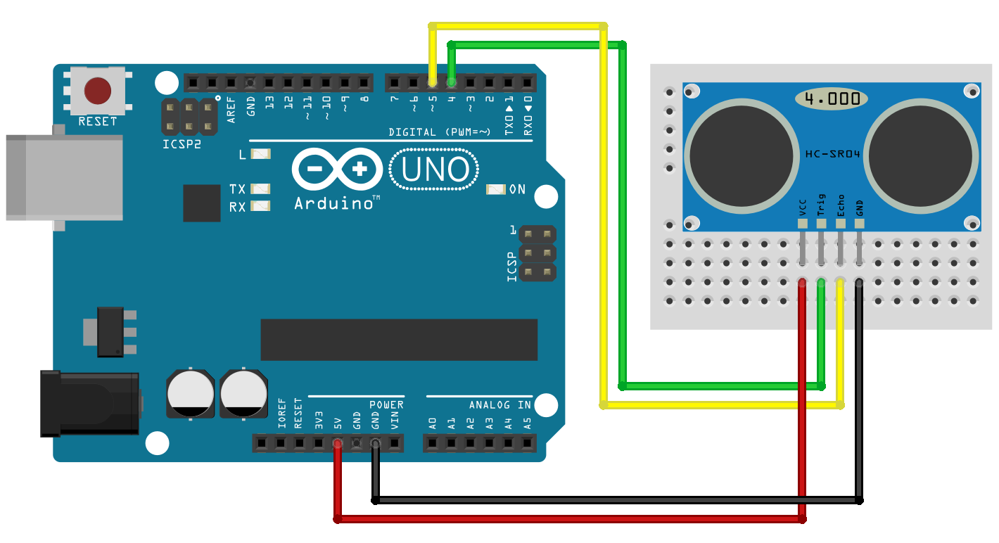

# Tutorial Sensor Ultrassônico

### Descrição do Componente

O **Sensor Ultrasonico HC-SR04** é aplicado com mais frequência em projetos de robótica, principalmente em chassis robóticos, robôs ou carrinhos. O sensor é capaz de medir com precisão \(3mm de margem de erro\) distâncias de 2cm até 4m.

A composição do **Sensor Ultrasonico HC-SR04** é feita de um emissor e um receptor ultrassônico, onde o sensor emite \(emissor\) sinais ultrassônicos que serão refletidos no obstáculo / objeto retornando ao sensor \(receptor\). Com base no tempo que o sinal emitido levou para retornar ao sensor, o mesmo efetua o cálculo da distância.

**Especificações e características:**

* Alimentação de 5V
* Corrente de 15miliAmperes
* Alcance 2cm a 4 Metro


### Código 

```c

//Carrega a biblioteca do sensor ultrassonico
#include <Ultrasonic.h>
 
//Define os pinos para o trigger e echo
#define pino_trigger 4 // envia 
#define pino_echo 5    // recebe 
 
//Inicializa o sensor nos pinos definidos acima
Ultrasonic ultrasonic(pino_trigger, pino_echo);
 
void setup()
{
  Serial.begin(9600);
  Serial.println("Lendo dados do sensor...");
}
 
void loop()
{
  //Le as informacoes do sensor, em cm e pol
  float cmMsec, inMsec;
  long microsec = ultrasonic.timing();
  cmMsec = ultrasonic.convert(microsec, Ultrasonic::CM);
  inMsec = ultrasonic.convert(microsec, Ultrasonic::IN);
  //Exibe informacoes no serial monitor
  Serial.print("Distancia em cm: ");
  Serial.print(cmMsec);
  Serial.print(" - Distancia em polegadas: ");
  Serial.println(inMsec);
  delay(1000);
}
```

### Circuito

Pinos utilizados 4 para enviar\(trigger\) e 5 para receber\(echo\) 




