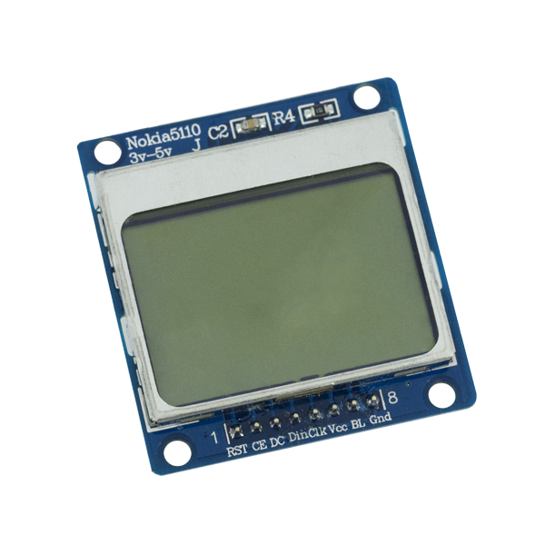

# Visualização

Nessa sessão vamos usar os displays 16x2 segmentos, display nokia e matriz de led.

### Display 16x2 segmentos

Um **display de cristal líquido**, [acrônimo](https://pt.wikipedia.org/wiki/Acr%C3%B4nimo) de **LCD** \(em [inglês](https://pt.wikipedia.org/wiki/L%C3%ADngua_inglesa) liquid crystal display\), é um painel fino usado para exibir informações por via eletrônica, como texto, imagens e vídeos. Seu uso inclui monitores para computadores, televisores, painéis de instrumentos e outros dispositivos, que vão desde cockpit de aeronaves, displays em computadores de bordo de automóveis, a dispositivos de utilização diárias, tais como leitores de vídeo, dispositivos de jogos, relógios, calculadoras e telefones.\([https://pt.wikipedia.org/wiki/LCD](https://pt.wikipedia.org/wiki/LCD)\)



### Display Nokia

Quando o assunto é displays é importante entendermos como é feita a organização da tela e as informações que serão impressas nela. Em resumo, uma tela é composta por uma matriz de pixels que estão organizados lado a lado. Cada pixel pode assumir uma cor, no caso de uma tela monocromática, cada pixel pode assumir uma cor opaca ou transparente.



