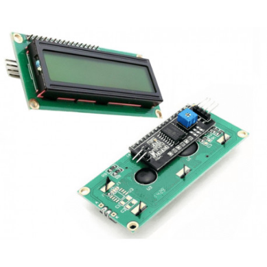
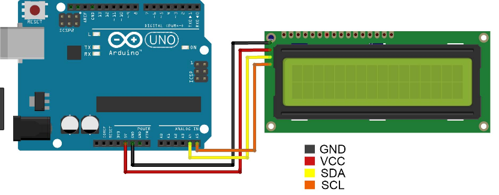

# Tutorial modulo i2c LCD 16x2 Segmentos

### Descrição

Este Display LCD 16x02 conta com um módulo I2C integrado. A tela possui fundo azul e suporta a exibição de até 16 caracteres \(na cor branco\) por linha em uma tela de 2 linhas, sendo especialmente indicado para aqueles que desenvolvem projetos com microcontroladores, como por exemplo o Arduino.

O módulo com interface I2C permite que o display de LCD 16x02 seja conectado ao microcontrolador através de apenas 2 fios de comunicação \(SDA e SCL\) mais 2 fios de alimentação \(GND e VCC\). Isto permite uma economia de pelo menos 4 pinos do microcontrolador.

Ideal para aplicações que exigem um display de LCD mas que o número de pinos disponíveis no microcontrolador está reduzido.



**Características do DISPLAY**:  
- Display LCD 16x02: 16 colunas e 02 linhas;  
- Luz de fundo: verde;  
- Escrita: caracter na cor preto;  
- Módulo Adaptador I2C integrado;  
- Compatível com Arduino, PIC, Atmel, etc.

**Especificações do Modulo I2C**:  
- Interface: Serial I2C;  
- Tensão de trabalho: 2,5V a 6V;  
- Pinos de conexão: SDA, SCL, GND e VCC;  
- Chip controlador: PCF8574T;  
- Displays suportados: LCD 16x02 e LCD 20x04;  
- Dimensões: 41,5mm x 19mm x 11,3mm;  
- Corrente em standby: 10uA;  
- Tipo de controlador: Expansor de portas I/O de 8 bits I2C;  
- Endereços: 0x20 a 0x27 \(Padrão 0x27\), pode ser alterado.

### Código

```c

#include <Wire.h>
#include <LiquidCrystal_I2C.h>

// Inicializa o display no endereco 0x27
LiquidCrystal_I2C lcd(0x27,2,1,0,4,5,6,7,3, POSITIVE);
 
void setup()
{
 lcd.begin (16,2);
}
 
void loop()
{
  lcd.setBacklight(HIGH);
  lcd.setCursor(0,0);
  lcd.print("Big Robots!!");
  lcd.setCursor(0,1);
  lcd.print("Community");
  delay(1000);
  lcd.setBacklight(LOW);
  delay(1000);
}
```

### Circuito



### Teste de Bancada




