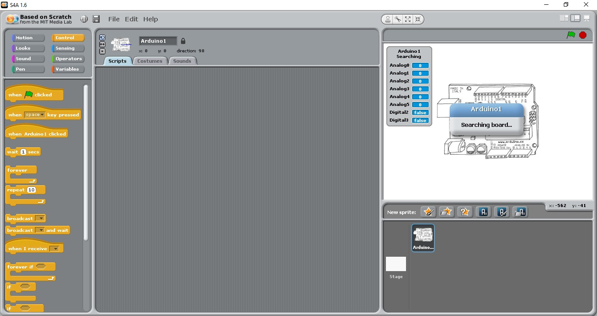

# Configurando Scratch 4 arduino

### 1º Passo

Faça o Download do arquivo abaixo



### 2º Passo

Com o codigo em mãos faça o upload do arquivo na IDE do arduino

### 3º Passo

Feche a IDE do arduino ao final do upload e abra o Scratch 4 Arduino

### FINAL

