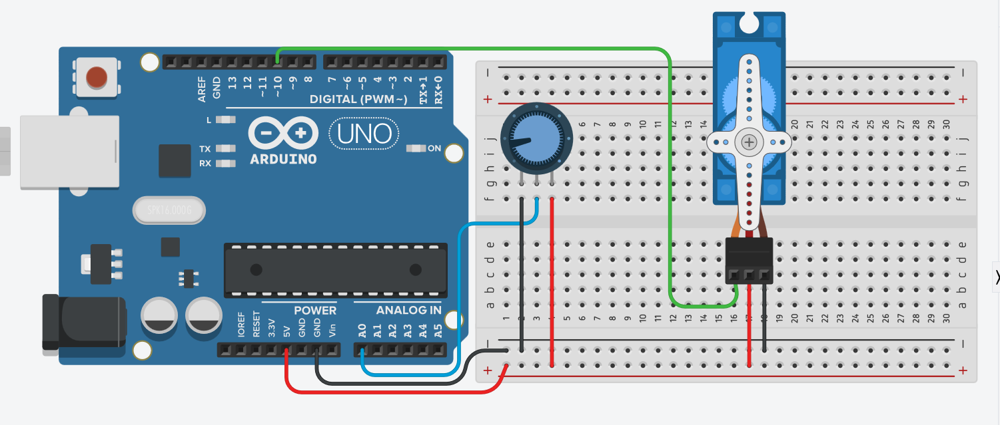

# Controlando Servo Motor com Potenciômetro

### Compontenste Nescessarios para Este projetinho

| QUANTIDADE | DESCRIÇÃO |
| :--- | :--- |
| 1 | ARDUINO UNO |
| 1  | POTENCIOMETRO |
| 1  | SERVO MOTOR |

### Circuito

### Código

### IMPORTANTE: SEMPRE DEFINIMOS DE 0 A 180 Para controlar SERVO MOTOR

### FUNÇÃO MAP

 Remapeia um número **de** um intervalo **para** outro. Isto é, um valor de **deMenor** seria mapeado para **paraMenor**, um valor de **deMaior** para **paraMaior**, valores dentro de uma faixa para volores dentro da outra faixa, etc.

#### Sintaxe no arduino 

`=map(valor, deMenor, deMaior, paraMenor, paraMaior);`

#### Parâmetros 

`valor`: o número a ser mapeado

`deMenor`: o menor limite do intervalo atual do valor

`deMaior`: o maior limite do intervalo atual do valor

`paraMenor`: o menor limite do intervalo alvo

`paraMaior`: o maior limite do intervalo alvo

#### Retorna 

O valor mapeado para o novo intervalo.

### Teste em Simulação 



