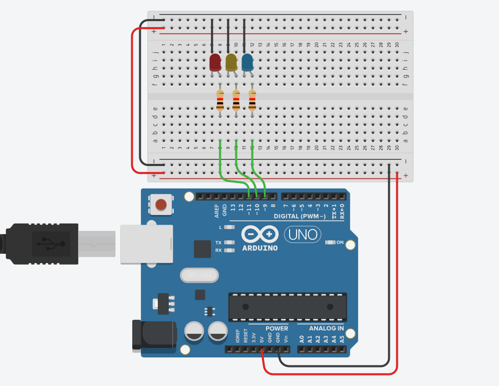
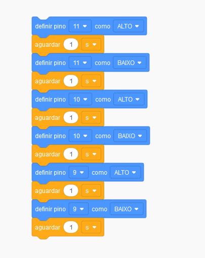

# Programando um Semáforo !

## Componentes Necessários 

| QUANTIDADE | DESCRIÇÃO |
| :--- | :--- |
| 3  | LEDS\(VERDE, VERMELHO E AMARELO\) |
| 3  | RESISTOR 1K |
| 1  | ARDUINO UNO |
| 1 | PROTOBOARD |

### CIRCUITO 

### CÓDIGO

### TESTE DE SIMULAÇÃO

